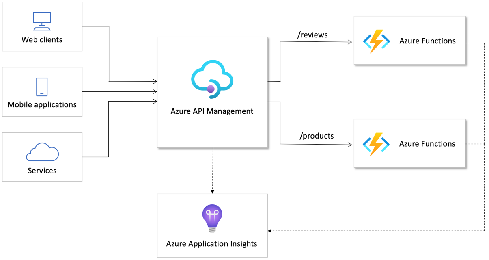

# Workshop: Serverless APIs in Azure

**This repository contains a set of entry-level exercises, which cover the basics of building and managing serverless APIs in Microsoft Azure - with Azure Functions, Azure API Management, and Azure Application Insights.**

After completing the workshop, you will be able to:

- Understand and articulate benefits of using API management and API gateway solutions in serverless architectures
- Expose serverless services as APIs
- Protect, accelerate, and transform APIs with runtime policies
- Observe the API traffic and identify problems across all layers of the stack
- Evolve your APIs with versions, without breaking client applications
- ... and more!

The image above illustrates the overall solution that will be created during the workshop.

## What are serverless APIs?

Serverless computing enables developers to build applications faster by eliminating the need for them to manage infrastructure. With serverless applications, the cloud service provider automatically provisions, scales, and manages the infrastructure required to run the code.

[Microsoft Azure offers a portfolio of serverless technologies](https://azure.microsoft.com/solutions/serverless/), which can be used for building APIs. In this workshop, we will implement APIs end-to-end with Azure Functions and Azure API Management, realizing the benefits of serverless solutions:

- **Automated scaling up and down, based on API traffic**, to serve bursty payloads and handle explosive growth of services
- **Architectural simplicity without no infrastructure management overhead**, to spend resources on innovating and solving business problems rather than managing infrastructure
- **Pay-per-consumption pricing model**, to reduce the barrier of entry to the market

## Repository contents

This repository contains source code of a sample serverless API implemented with Azure Functions as well as six exercises:

1. [Setting up the Azure environment](./readme/1%20-%20Provision%20Azure%20resources.md)
1. [Exposing Functions as APIs in API Management](./readme/2%20-%20Import%20APIs.md)
1. [Packaging APIs with Products](./readme/3%20-%20Products.md)
1. [Applying API runtime policies](./readme/4%20-%20Apply%20policies%20and%20revisions.md)
1. [Monitoring APIs with Application Insights](./readme/5%20-%20Monitoring.md)
1. [Versioning APIs](./readme/6%20-%20Versions.md)

The exercises require minimal knowledge of programming. Each exercise contains references to additional resources, such as documentation, blog posts, or conference session recordings.

## Getting started

Get started with [Exercise 1: Provisioning Azure Resources](./readme/1%20-%20Provision%20Azure%20resources.md).

## Related resources

- Blog post one
- Blog post two
- [Benefits of API Management in microservices-based architectures](https://aka.ms/apimserverlessblog)
- Azure Functions: [product overview](https://azure.microsoft.com/services/functions/), [documentation](https://docs.microsoft.com/azure/azure-functions/)
- Azure API Management: [product overview](https://aka.ms/apimlearn), [documentation](https://aka.ms/apimdocs)
- [Azure Serverless overview](https://azure.microsoft.com/overview/serverless-computing/)
- [Serverless APIs module on Microsoft Learn](https://docs.microsoft.com/learn/modules/build-serverless-api-with-functions-api-management/)