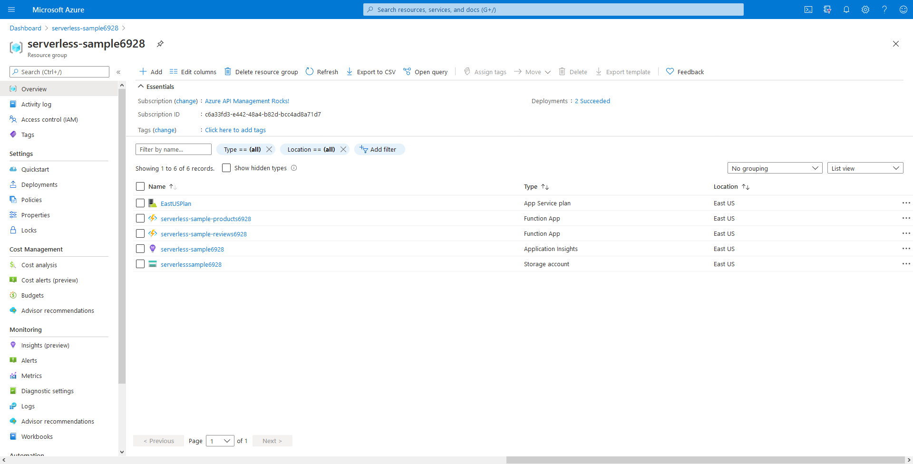

# Exercise 1: Provisioning Azure Resources

The focus of this workshop is to learn how to deploy, operate, and integrate Azure API Management with Azure Functions. In this exercise, we will run a script to provision all the infrastructure and cloud assets required for the remaining exercises.

There are two options to run the provisioning script:

1. If you are familiar with Azure Cloud Shell or don't want to install the prerequisites on your computer, you can run the script directly from [Azure Portal Cloud Shell servive](https://docs.microsoft.com/azure/cloud-shell/quickstart).
2. Otherwise, you can use your Azure CLI on your local machine.

## Prerequisites

* [Azure CLI](https://docs.microsoft.com/cli/azure/install-azure-cli-macos?view=azure-cli-latest)
* [Azure Functions Core Tools](https://github.com/Azure/azure-functions-core-tools)

Azure Functions Core Tools includes a version of the same runtime that powers Azure Functions runtime. You can run it on your local development computer. It also provides commands to create functions, connect to Azure, and deploy Functions projects.

## Steps

Perform the following steps to provision the cloud resources: 

1. Clone this repo to your local computer or to your Linux Azure Cloud Shell
2. Run the `serverless-apim-setup.sh` script:
    ```sh
        $ ./serverless-apim-setup.sh -s <SUBSCRIPTION ID>
    ```

    For example, on Windows:
    ```sh
        .\serverless-apim-setup.sh -s "aaaaaaaa-bbbb-cccc-dddd-eeeeeeeeeeee"
    ```
    
    This script doesn't require interactions. It will provision the following resources with a randomly-generated suffix:
    
    - **serverless-sample** Resource Group
    - **serverlesssample** Storage Account
    - **serverless-sample** Application Insights
    - **serverless-sample-products** Azure Function App
    - **serverless-sample-reviews** Azure Function App
    
    Output commands will be saved in `serverless-apim-setup.log` file in the main folder of this repo. All the services will be deployed in the East US region, unless you specify a different region in the *location* variable in the `serverless-apim.sh` file. 

3. You should have all the services mentioned above deployed in your Azure subscription.

    

4. For each created Function App:

    1. Navigate to it in the Azure portal.
    1. Click on Application Insights in the menu on the left.
    1. Assign the newly created Application Insights service. You can refer to [the official Azure documentation for details](https://docs.microsoft.com/azure/azure-functions/functions-monitoring?tabs=cmd#view-telemetry-in-application-insights).

## Related resources

* [Install the Core Tools and dependencies.](https://github.com/Azure/azure-functions-core-tools)
* [Run the function locally](https://docs.microsoft.com/azure/azure-functions/functions-run-local?tabs=macos%2Ccsharp%2Cbash#start)
* [Publish the project to Azure.](https://docs.microsoft.com/azure/azure-functions/functions-run-local?tabs=macos%2Ccsharp%2Cbash#publish)

## Next steps

[Import APIs into Azure API Management](./2%20-%20Import%20APIs.md)