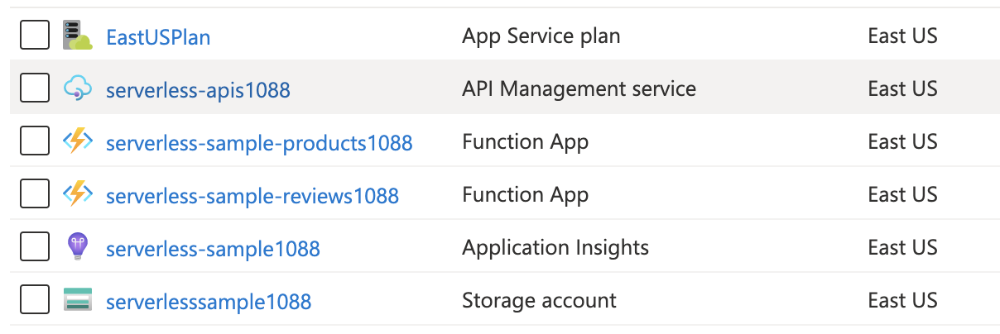

# Exercise 1: Provisioning Azure Resources

As the focus of this workshop is to learn how to deploy, operate and integrate API Managente with Azure Functions, we will use a simple script to provision all the infrastructure to run thru the other exercises and focus on what we want.

There are two options to run our provisioning script.

1 - If you are familiar with Azure Cloud Shell or don't want to install the pre-reqs in your machine, you can run the script direct from your [Azure Portal Cloud Shell servive](https://docs.microsoft.com/en-us/azure/cloud-shell/quickstart).

2 - If you prefer, you can use your Azure CLI on your local machine.

## Pre-reqs

* [Azure CLI](https://docs.microsoft.com/en-us/cli/azure/install-azure-cli-macos?view=azure-cli-latest)
* [Azure Functions Core Tools](https://github.com/Azure/azure-functions-core-tools)
* [Azure API Management CLI Extension](https://docs.microsoft.com/en-us/cli/azure/azure-cli-extensions-overview?view=azure-cli-latest)

Azure Functions Core Tools includes a version of the same runtime that powers Azure Functions runtime that you can run on your local development computer. It also provides commands to create functions, connect to Azure, and deploy function projects.

## Steps

Perform the following steps to deploy your Workshop infrastructure: 

1 - Clone this repo to your local computer or to your Linux Azure Cloud Shell
2 - Run the [serverless-apim-setup.sh] to deploy our workshop infrastructure by runnung the follow command:
```
 $ ./serverless-apim.sh -s <SUBSCRIPTION ID>
```
This script is a non interactive script, it will generate a randon number to use it as a sufix* for all services listed bellow: 


- **serverless-sample** Resource Group
- **serverlesssample** Storage Account
- **serverless-sample** Application Insights
- **serverless-sample-products** Azure Function App 
- **serverless-sample-reviews** Azure Function App
- **serverless-apis** Azure API Management Consuption Plan Instance

> All output commands will be saved in ***serverles-apim-setup.log*** file in the main folder of this repo. 

Check if you have all these services deployed to your Azure Subscription. 



And that's it :) 

> Note: All the services will be deployed to EAST US region by default. If you want to deploy in a different region, edit serverless-apim.sh file and change the value of ***location*** variable to your favorite one. 

## Related resources

* [Install the Core Tools and dependencies.](https://github.com/Azure/azure-functions-core-tools)
* [Run the function locally](https://docs.microsoft.com/en-us/azure/azure-functions/functions-run-local?tabs=macos%2Ccsharp%2Cbash#start)
* [Publish the project to Azure.](https://docs.microsoft.com/en-us/azure/azure-functions/functions-run-local?tabs=macos%2Ccsharp%2Cbash#publish)

## Next steps

[Import APIs into Azure API Management](./2%20-%20Import%20APIs.md)