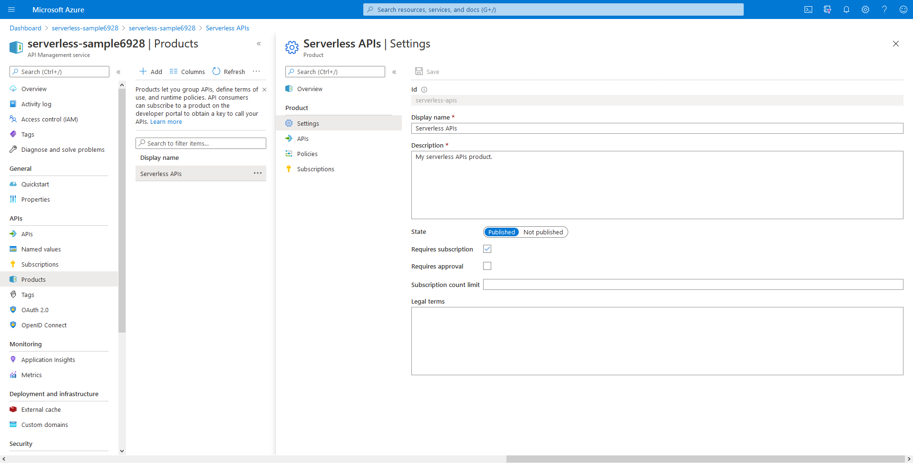
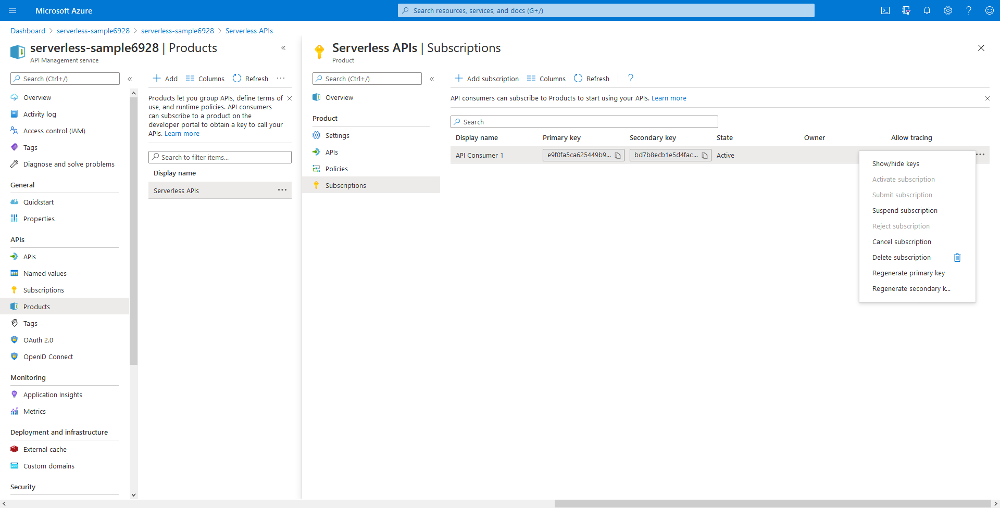

# Exercise 3: Azure API Management Products

In the last exercise, we imported our serverless APIs into our API Management service. In this exercise, we will look at the API Management **product** concept.

## What is an API Management product and why use it?

An API Management Product is a way to organize and manage one or more APIs. You can include a number of APIs and offer them to developers (consumers of your APIs).

The benefits of using products include:

- Ability to package one or more APIs to your developers (consumers)
- Ability to create both products requiring subscriptions (**Protected**) and products which do not (**Open**)
- Ability to publish/unpublish products for general availability
- Ability to apply policy (such as usage quota), specify whether approval is required, legal terms at a product level when bundling APIs for business reasons
- Ability to control visibility and access to products within the [API Management Developer Portal](https://docs.microsoft.com/azure/api-management/api-management-key-concepts#--developer-portal) by associating to groups (applies only to dedicated [API Management tiers](https://docs.microsoft.com/azure/api-management/api-management-features) only; not available in the Consumption tier)

## Steps

### Create Product

1. Navigate to your API Management instance in the Azure portal.
1. Select **Products** section from the menu on the left.
1. Click **+ Add** to add a new product.
1. Provide a **Display name** for the product, such as **"Serverless APIs"** (everything between the quotes).
1. The **Id** field will be automatically populated if you've provided a Display name, however you can choose to override it if you wish.
1. Enter a **Description** for the product.
1. Since we are using the API Management Consumption tier which does not include a Developer Portal, the publishing state of our product has no effect and we can just leave the default **Not published** setting.
1. By default, **Requires subscription** is checked. This means that in order for a consumer to call the API, they will need to provide a subscription key.
1. Click **Select API** and check the API(s) you imported from the previous exercise. Click **Select**.
1. Click **Create** to complete your new API Management product.

### Create a Product Subscription

We need to create a subscription in order to call our API as part of this product. A subscription is a set of two keys for associated APIs. You need to provide one of the subscription keys when invoking a protected API by providing the key in the **Ocp-Apim-Subscription-Key** HTTP header.

Since we created our API Management product to require subscriptions, we now need to create a subscription to that product to generate an initial set of keys to use.

1. In your API Management instance in the Azure portal, select the **Products** section from the menu on the left.
1. Select the product you created from the previous section. This will take you to the product overview for that product.
1. Select the product **Subscriptions** menu option.
1. Click **+ Add Subscription** to add a new subscription for the product.
1. Give the new subscription a **Name** (e.g. **api-consumer-1**) and a **Display name** (e.g. **API Consumer 1**).
1. Click **Yes** for **Allow tracing**.
1. Click **Save**.
1. At this point, you should see your new subscription listed for the product. To view the actual key values for the subscription, click on the ellipses **...** and then **Show/hide keys** menu option.

    

## Related resources

- [Learn how to create and publish a product](https://docs.microsoft.com/azure/api-management/api-management-howto-add-products)
- [Learn more about API Management concepts](https://docs.microsoft.com/azure/api-management/api-management-key-concepts#--developer-portal)
- [Learn about policies in API Management](https://docs.microsoft.com/azure/api-management/api-management-howto-policies)
- [Learn about different API Management tiers](https://docs.microsoft.com/azure/api-management/api-management-features)
- [Learn about the API Management developer portal](https://docs.microsoft.com/azure/api-management/api-management-key-concepts#--developer-portal)

## Next steps

[Apply policies and revisions](./4%20-%20Apply%20policies%20and%20revisions.md)
