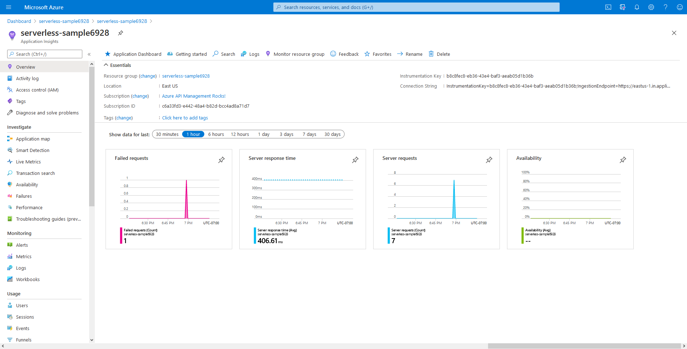
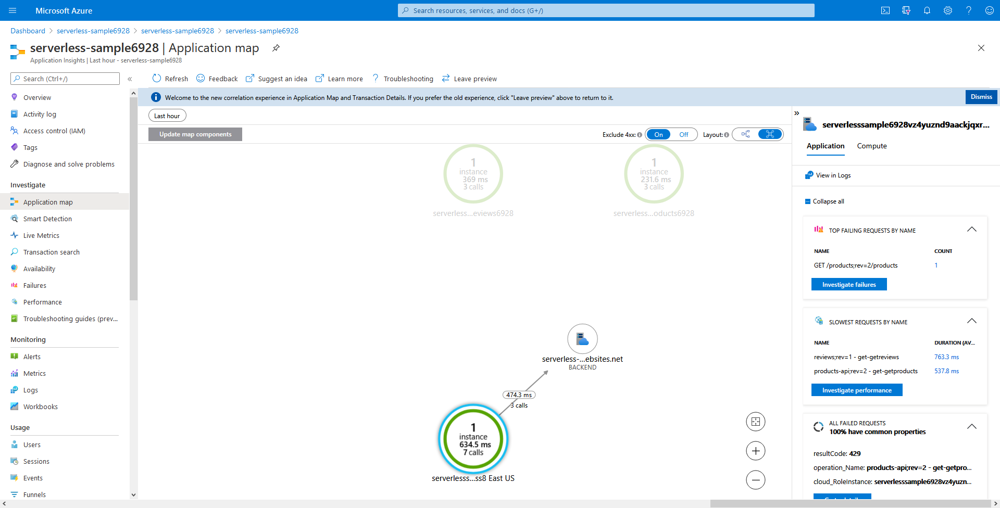
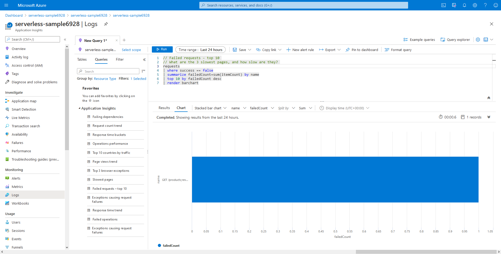

# Exercise 5: Monitoring APIs

In this exercise, we will scratch the surface of the available observability options for your APIs. We will explore the capabilities of Azure Application Insights to monitors the availability, performance, and usage of our Functions and APIs.

## Why use Application Insights with API Management

As an Azure service, Azure API Management can leverage [Azure Monitor](https://docs.microsoft.com/azure/azure-monitor/overview) for collecting, analyzing, and acting on your APIs' telemetry. Azure Monitor is an umbrella of monitoring and management services that leverage a common, powerful data collection and analysis platform and it includes Application Insights.

## Steps

In the first exercise, we attached Application Insights to our Functions. In the second exercise, we enabled it for our APIs in API Management. All the resources use a common Application Insights resource, which lets us explore the traces end-to-end.

### Explore the Azure API Management overview dashboard

1. Navigate to your API Management service in the Azure portal.
1. On the overview section, notice there is a already a dashboard available with some basic metric charts, such as **Gateway requests** and **Overall request duration**. This is a useful starting point for a general overview of API Management telemetry and can provide useful insights for taking action.

### Explore Application Insights integration

For more detailed telemetry and more advanced monitoring scenarios, we will use Application Insights.

1. Navigate to your API Management service in the Azure portal.

1. On the left, go to **Application Insights**. You should see the name of an associated Application Insights resource listed in a table on the right.

1. On the row containing the name of the Application Insights resource, click on the ellipses (**...**) and select **Go to**. This will take you to the Application Insights resource overview page. Notice that Application Insights also has a small dashboard on its Overview section.

    

1. Click on **Application map** on the left. The application map feature will allow you to see an overview of all associated application components reporting telemetry to the Application Insights resource. You should be able to see the API Management resource along with the Function App backends. From the map, you can drill into each component to view associated telemetry. You can watch the Azure Friday video [Azure API Management for Serverless Applications](https://youtu.be/82q67x769XE?t=438) for brief demo on the application map.

    

1. Next, select **Logs** in the menu bar on the left.

1. You should see a dialog of **Example queries** that you can use to try on the data collected by Application Insights from the associated API Management and Function App instances. The query syntax is in a language called Kusto Query Language (or KQL for short). You can learn more about KQL in [the official documentation](https://docs.microsoft.com/azure/azure-monitor/log-query/query-language).

    

1. Find the **Failed requests - top 10** example query and click **Run**. Recall that we added a `rate-limit` policy from a previous exercise. If `rate-limit` was triggered, it would result in a failed request.

1. Click on **Example queries** at the top and then find the **Exceptions causing request failures** sample query and click **Run**. You should now see a count of the tracked HTTP 429 status codes caused by triggering the `rate-limit` policy.

## Related resources

- [Monitor published APIs](https://docs.microsoft.com/azure/api-management/api-management-howto-use-azure-monitor)
- [How to integrate Azure API Management with Azure Application Insights](https://docs.microsoft.com/azure/api-management/api-management-howto-app-insights)
- [KQL Query Language Documentation](https://docs.microsoft.com/azure/azure-monitor/log-query/query-language)
- [Azure API Management for Serverless Applications video](https://youtu.be/82q67x769XE?t=438)

## Next steps

[Publish a new version](./6%20-%20Versions.md)